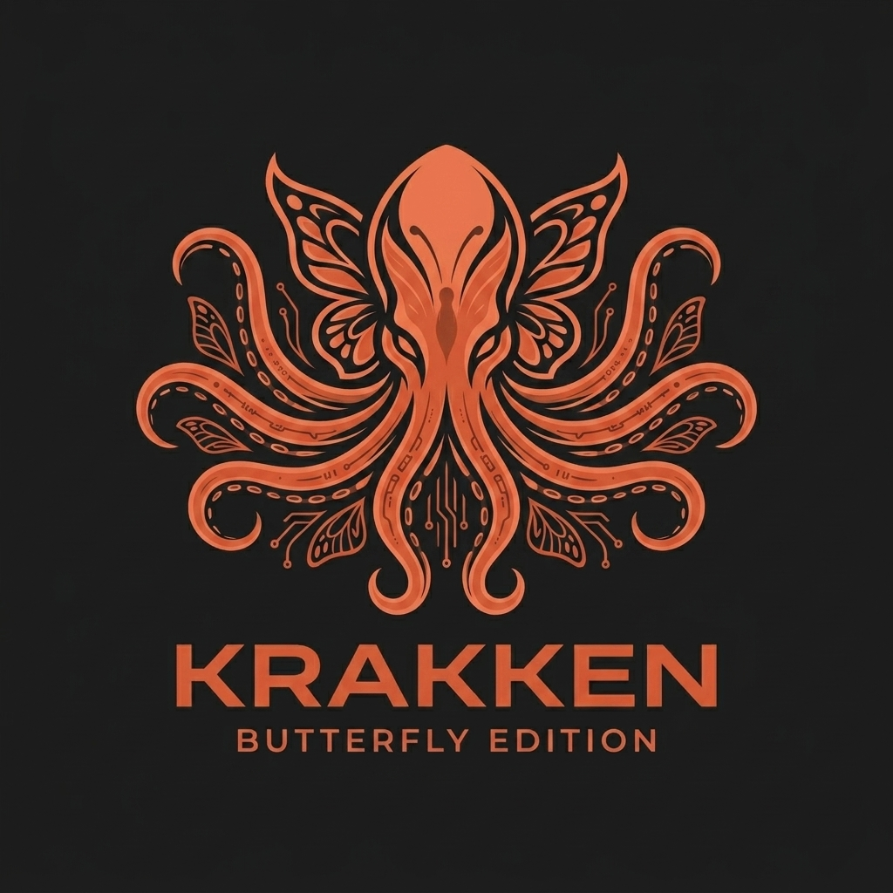
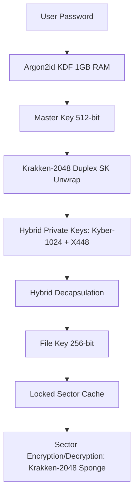

<div align="center">
  
</div>

# 🐙 Krakken-Disk v4.6.0 (Butterfly Edition)

[](LICENSE)
[](#)
[](#)
[](#)

**Krakken-Disk** is an ultra-secure, high-performance encrypted disk manager engineered specifically for the post-quantum era. Powered by the massive 2048-bit **Krakken Abyssal** permutation, Krakken-Disk provides a uniform 256-bit post-Grover security margin across all volume layers. By combining cutting-edge lattice-based cryptography, elliptic curve cryptography, and hardware-accelerated AVX2 SIMD architectures, it ensures your data remains completely private even against future quantum computing adversaries.

---

## 🌌 Key Highlights

*   🛡️ **Post-Quantum Security Margin**: Native 2048-bit wide-state permutation providing a uniform 256-bit post-Grover security margin (Header & Data layers).
*   🧬 **Hybrid Key Encapsulation (KEM)**: Combines post-quantum **Kyber-1024** (lattice-based) and classical **X448** (elliptic curve Diffie-Hellman) to secure master and file keys.
*   ⚡ **Abyssal Permutation Core**: Hand-tuned **AVX2 SIMD** vectorizations with register-only MDS mixing and column pressure steps for maximum performance on modern CPUs.
*   🌑 **Plausible Deniability**: Full **IND-RND** compliance—volumes have no identifiable headers, signatures, or metadata blocks, rendering them mathematically indistinguishable from raw thermal noise or random data.
*   🔒 **Anti-Brute Force Protection**: Uses **Argon2id** key derivation locked with 1 GB of RAM to render GPU- and ASIC-based brute-force attacks economically and computationally impossible.
*   🔄 **Dual-Generation Compatibility**: Seamless trial-decryption supports legacy V3 volumes (XChaCha) and next-generation V4 volumes (Krakken-2048).
*   🐧 **FUSE 3 Mounting**: Exposes encrypted containers as transparent, read-write filesystem directories in user space.

---

## 🛠️ Cryptographic Architecture

Krakken-Disk employs a multi-tiered cryptographic design to protect files from physical and quantum adversaries:



### 1. The Krakken Abyssal Permutation
Operating over a 2048-bit state (32 x 64-bit lanes) structured as a 4x8 column grid, the permutation executes 10 rounds of mathematical transformations:
-   **Theta ($\theta$)**: Column parity mixing.
-   **Tentacle MDS**: High-diffusion Maximum Distance Separable matrix multiplication in $\text{GF}(2^8)$ implemented via AVX2 shuffle instructions.
-   **Rho ($\rho$) & Pi ($\pi$)**: Bit-shifts and lane transpositions.
-   **Chi ($\chi$)**: Non-linear S-box layer utilizing the custom 8-bit Abyssal S-box (Active NL=112).
-   **Pressure ARX**: Add-Rotate-XOR col-mixing to resist differential cryptanalysis.
-   **Beta-Iota ($\beta$/$\iota$)**: Round constant injection derived via SHAKE-128.
-   **Ink Cloud**: final lane-mixing step.

### 2. High-Performance AEAD Stream Encryption
For file operations, Krakken-Disk divides streams into fixed 4 MB segments. Each segment is processed independently in parallel using a thread-pool (up to 8 hardware threads) with its own sponge state:
$$\text{keystream}_i = \text{Krakken-Sponge}(\text{FileKey} \mathbin{\Vert} \text{Nonce} \mathbin{\Vert} \text{LE64}(i))$$
A BLAKE2b-256 MAC is computed over the entire stream for ciphertext authentication.

---

## 📋 Prerequisites

To compile and run Krakken-Disk on Linux, ensure you have the following packages installed:

### Build System & Compilers
- **GCC** (with AVX2 instruction set support and C11/GNU11 standard compatibility)
- **GNU Make**
- **pkg-config**

### Required Libraries
- **libsodium** (Cryptographic primitives)
- **libcrypto** (OpenSSL EVP for X448 scalarmult)
- **FUSE 3** (`libfuse3-dev` / `fuse3` - Virtual filesystem interface)

### Graphical User Interface (GTK)
- **GTK 3** or **GTK 4** development libraries (used to build the modern dark-themed graphical dashboard)
- **ncurses** (automatically falls back to a terminal UI if no GUI environment is found)

### Install Dependencies (Debian/Ubuntu)
```bash
sudo apt update
sudo apt install build-essential pkg-config libsodium-dev libssl-dev libfuse3-dev libgtk-3-dev libncurses5-dev
```

---

## ⚙️ Compilation & Installation

### 1. Dependency Validation
Validate that all required tools and libraries are present on your system:
```bash
make check-deps
```

### 2. Compilation
To build the optimized production binary (automatically detects CPU features and utilizes AVX2):
```bash
make
```
*To inspect the underlying compiler flags and commands during build, run in verbose mode:*
```bash
make V=1
```

### 3. Installation
Install the application globally, which copies the executable to `/usr/local/bin`, registers the desktop application shortcut, and installs the Krakken logo:
```bash
sudo make install
```

### 4. Uninstallation
To completely remove Krakken-Disk and its configuration entries from the host system:
```bash
sudo make uninstall
```

---

## 🚀 How to Use

### Launching the Application
If installed globally, launch Krakken-Disk from your desktop applications menu, or invoke it directly:
```bash
krakken-disk
```
Alternatively, execute it out of the build directory:
```bash
make run
```

### Volume Management Workflow

#### 1. Creating a Secure Container
1. Enter the target output path for the volume in the **Encrypted Volume File** box.
2. Specify the size of the volume in Megabytes (minimum: 10 MB, maximum: 1 TB).
3. Type a strong passphrase in the **Credentials** card.
4. Click **Create Volume**. A progress bar will reflect the structural creation and formatting of the virtual filesystem.

#### 2. Accessing (Mounting) an Existing Volume
1. Click the **Browse** folder icon to select your encrypted volume file.
2. Type the password in the **Credentials** pane.
3. Click **Open**. The status panel will confirm the trial-decryption status.
4. Click **Mount** and select a target folder directory in your filesystem. The FUSE daemon will run in the background, mounting the volume.
5. You can now read, write, copy, and modify files within that folder.
6. Once finished, click **Unmount** and **Close** to flush all modifications to disk and lock the cryptographic keys.

---

## 🔒 Security Best Practices

> [!WARNING]
> **Unencrypted Swap Partition Alert**
>
> Upon startup, Krakken-Disk inspects `/proc/swaps` to determine if unencrypted swap memory is active. If detected, it displays a security warning. Unencrypted swap can write active memory pages containing keys or plaintexts to persistent storage, compromising security. It is highly recommended to disable swap (`sudo swapoff -a`) or encrypt it using LUKS.

> [!IMPORTANT]
> **Memory Locking (mlock)**
>
> Krakken-Disk attempts to call `sodium_mlock` on all sensitive key containers, file handles, and cache sectors to prevent them from being paged out to disk. To enable this, ensure your user shell has sufficient limits or run the program with elevated privileges.

---

## 👥 Authors & Contact

- **Lead Cryptographer & GUI Developer**: Jean-Francois Lachance-Caumartin (Effjy)
- **Contact**: [effjy@protonmail.com](mailto:effjy@protonmail.com)

This project is licensed under the MIT License - see the [LICENSE](LICENSE) file for details.

