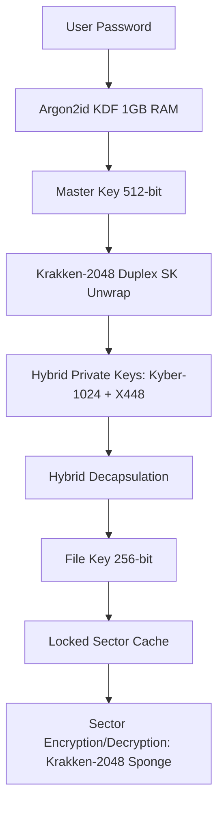

# 🐙 Krakken-Disk v5.0.0 (Butterfly Edition)

[](LICENSE)
[](#)
[](#)
[](#)

---

**Krakken-Disk** is an ultra-secure, high-performance encrypted disk manager engineered specifically for the post-quantum era. Powered by the massive 2048-bit **Krakken Abyssal** permutation, Krakken-Disk provides a uniform 256-bit post-Grover security margin across all volume layers. By combining cutting-edge lattice-based cryptography, elliptic curve cryptography, and hardware-accelerated AVX2 SIMD architectures, it ensures your data remains completely private even against future quantum computing adversaries.

---

## 🌌 Key Highlights

*   🛡️ **Post-Quantum Security Margin**: Native 2048-bit wide-state permutation providing a uniform 256-bit post-Grover security margin (Header & Data layers).
*   🧬 **Hybrid Key Encapsulation (KEM)**: Combines post-quantum **Kyber-1024** (lattice-based) and classical **X448** (elliptic curve Diffie-Hellman) to secure master and file keys.
*   ⚡ **Abyssal Permutation Core**: Hand-tuned **AVX2 SIMD** vectorizations with register-only MDS mixing and column pressure steps for maximum performance on modern CPUs.
*   🌑 **Plausible Deniability**: Full **IND-RND** compliance—volumes have no identifiable headers, signatures, or metadata blocks, rendering them mathematically indistinguishable from raw thermal noise or random data.
*   🔒 **Anti-Brute Force Protection**: Uses **Argon2id** key derivation locked with 1 GB of RAM to render GPU- and ASIC-based brute-force attacks economically and computationally impossible.
*   🐧 **FUSE 3 Mounting**: Exposes encrypted containers as transparent, read-write filesystem directories in user space.

---

## 🛠️ Cryptographic Architecture

Krakken-Disk employs a multi-tiered cryptographic design to protect files from physical and quantum adversaries:



### Krakken-2048 Butterfly Round Function (9 Layers)

The permutation executes **8 rounds**, each composed of nine distinct layers in sequential order:

| Layer | Name | Type | Description |
|-------|------|------|-------------|
| **L1** | $\Theta$ (Theta) | SPN | Column parity mixing |
| **L2** | $\Sigma$ (Sigma) | SPN | Circulant MDS over GF($2^8$) |
| **L3** | $\rho$ (Rho) | SPN | Per-word rotation |
| **L4** | $\Pi$ (Pi) | SPN | Column permutation |
| **L5** | $\chi$ (Chi) | SPN | ABYSSAL S-box (cross-coupled pairs) |
| **L6** | **Butterfly Diffusion (XRBD)** | **Novel** | **5-stage XOR-rotation butterfly network** |
| **L7** | **PRESSURE** | ARX | Modular addition with XOR-shift mixing |
| **L8** | $\iota$ (Iota) | Key Schedule | Round constant addition (per-word) |
| **L9** | **InkCloud** | Diffusion | Global word permutation + rotation |

### Layer 6 — Butterfly Diffusion (XRBD): Full-State Mixing

The XOR-Rotation Butterfly Diffusion (XRBD) layer is the **central architectural novelty** of Krakken-2048. It solves the problem of mixing all 32 words of state such that every output word depends on every input word after a single pass, using only word-level XOR and rotation operations.

**Definition:** Let $r_0, r_1, r_2, r_3, r_4$ be rotation constants $(13, 23, 37, 41, 53)$. For stage $k \in \{0,1,2,3,4\}$, let $\delta_k = 2^k \in \{1,2,4,8,16\}$. For all $i \in [32]$ with $(i \mathbin{\&} \delta_k) = 0$, execute:

$$
\begin{aligned}
\text{state}[i] &\leftarrow \text{state}[i] \oplus \text{state}[i \oplus \delta_k], \\
\text{state}[i \oplus \delta_k] &\leftarrow \text{state}[i \oplus \delta_k] \oplus \text{RotL}(\text{state}[i], r_k).
\end{aligned}
$$

**Key Properties:**
- **Bijective:** Each crossover step is invertible (Theorem 1 in paper)
- **Complete Dependency:** Achieves $\log_2(32) = 5$ stages for full word-level mixing (Theorem 2)
- **Optimal:** Matches the theoretical lower bound for pairwise-mixing networks (Theorem 3)
- **Rotation-Enhanced:** Asymmetric rotation constants break bit-aligned symmetries

### Layer 7 — PRESSURE: ARX Mixing

After the Butterfly Diffusion layer connects all 32 words, PRESSURE introduces modular-arithmetic non-linearity via carry propagation that crosses byte boundaries.

For each column $c \in [8]$ with words $(a, b, cc, d)$:

$$
\begin{aligned}
a &\leftarrow a + (cc \oplus (cc \gg 17)), \\
b &\leftarrow b + (d \oplus (d \gg 17)), \\
cc &\leftarrow cc + (a \oplus (a \ll 31)), \\
d &\leftarrow d + (b \oplus (b \ll 31)),
\end{aligned}
$$

followed by post-rotations: $b \leftarrow \text{RotL}(b, 7)$, $d \leftarrow \text{RotL}(d, 19)$.

### Layer 9 — InkCloud Shuffle

The final step of each round is a global word permutation combined with rotation:

$$
\text{state}'[(7i) \bmod 32] \leftarrow \text{RotL}(\text{state}[i], 11), \quad i \in [32].
$$

The multiplier $7$ (coprime to $32$) generates a full 32-cycle, ensuring every word returns to its original position only after 32 rounds.

### The Krakken Abyssal Permutation (Full Round)

Operating over a 2048-bit state (32 × 64-bit lanes) structured as a 4×8 column grid, each round executes:

1. **$\Theta$ (Theta)** — Column parity mixing
2. **$\Sigma$ (Sigma)** — Circulant MDS over GF($2^8$)
3. **$\rho$ (Rho)** — Per-word rotations
4. **$\Pi$ (Pi)** — Column permutation
5. **$\chi$ (Chi)** — ABYSSAL S-box (cross-coupled pairs)
6. **Butterfly Diffusion (XRBD)** — 5-stage XOR-rotation network
7. **PRESSURE** — ARX mixing with carry propagation
8. **$\iota$ (Iota)** — Round constant addition (per-word)
9. **InkCloud** — Global word permutation + rotation

### High-Performance AEAD Stream Encryption

For file operations, Krakken-Disk divides streams into fixed 4 MB segments. Each segment is processed independently in parallel using a thread-pool (up to 8 hardware threads) with its own sponge state:

$$\text{keystream}_i = \text{Krakken-Sponge}(\text{FileKey} \mathbin{\Vert} \text{Nonce} \mathbin{\Vert} \text{LE64}(i))$$

A BLAKE2b-256 MAC is computed over the entire stream for ciphertext authentication.

---

## 📋 Prerequisites

To compile and run Krakken-Disk on Linux, ensure you have the following packages installed:

### Build System & Compilers
- **GCC** (with AVX2 instruction set support and C11/GNU11 standard compatibility)
- **GNU Make**
- **pkg-config**

### Required Libraries
- **libsodium** (Cryptographic primitives)
- **libcrypto** (OpenSSL EVP for X448 scalarmult)
- **FUSE 3** (`libfuse3-dev` / `fuse3` - Virtual filesystem interface)

### Graphical User Interface (GTK)
- **GTK 3** or **GTK 4** development libraries (used to build the modern dark-themed graphical dashboard)
- **ncurses** (automatically falls back to a terminal UI if no GUI environment is found)

### Install Dependencies (Debian/Ubuntu)
```bash
sudo apt update
sudo apt install build-essential pkg-config libsodium-dev libssl-dev libfuse3-dev libgtk-3-dev libncurses5-dev
```

---

## ⚙️ Compilation & Installation

### 1. Dependency Validation
Validate that all required tools and libraries are present on your system:
```bash
make check-deps
```

### 2. Compilation
To build the optimized production binary (automatically detects CPU features and utilizes AVX2):
```bash
make
```
*To inspect the underlying compiler flags and commands during build, run in verbose mode:*
```bash
make V=1
```

### 3. Installation
Install the application globally, which copies the executable to `/usr/local/bin`, registers the desktop application shortcut, and installs the Krakken logo:
```bash
sudo make install
```

### 4. Uninstallation
To completely remove Krakken-Disk and its configuration entries from the host system:
```bash
sudo make uninstall
```

---

## 🚀 How to Use

### Launching the Application
If installed globally, launch Krakken-Disk from your desktop applications menu, or invoke it directly:
```bash
krakken-disk
```
Alternatively, execute it out of the build directory:
```bash
make run
```

### Volume Management Workflow

#### 1. Creating a Secure Container
1. Enter the target output path for the volume in the **Encrypted Volume File** box.
2. Specify the size of the volume in Megabytes (minimum: 10 MB, maximum: 1 TB).
3. Type a strong passphrase in the **Credentials** card.
4. Click **Create Volume**. A progress bar will reflect the structural creation and formatting of the virtual filesystem.

#### 2. Accessing (Mounting) an Existing Volume
1. Click the **Browse** folder icon to select your encrypted volume file.
2. Type the password in the **Credentials** pane.
3. Click **Open**. The status panel will confirm the trial-decryption status.
4. Click **Mount** and select a target folder directory in your filesystem. The FUSE daemon will run in the background, mounting the volume.
5. You can now read, write, copy, and modify files within that folder.
6. Once finished, click **Unmount** and **Close** to flush all modifications to disk and lock the cryptographic keys.

---

## 🔒 Security Best Practices

> [!WARNING]
> **Unencrypted Swap Partition Alert**
>
> Upon startup, Krakken-Disk inspects `/proc/swaps` to determine if unencrypted swap memory is active. If detected, it displays a security warning. Unencrypted swap can write active memory pages containing keys or plaintexts to persistent storage, compromising security. It is highly recommended to disable swap (`sudo swapoff -a`) or encrypt it using LUKS.

> [!IMPORTANT]
> **Memory Locking (mlock)**
>
> Krakken-Disk attempts to call `sodium_mlock` on all sensitive key containers, file handles, and cache sectors to prevent them from being paged out to disk. To enable this, ensure your user shell has sufficient limits or run the program with elevated privileges.

---

## 👥 Authors & Contact

- **Lead Cryptographer & GUI Developer**: Jean-Francois Lachance-Caumartin (Effjy)
- **Contact**: [effjy@protonmail.com](mailto:effjy@protonmail.com)

This project is licensed under the MIT License - see the [LICENSE](LICENSE) file for details.
```
